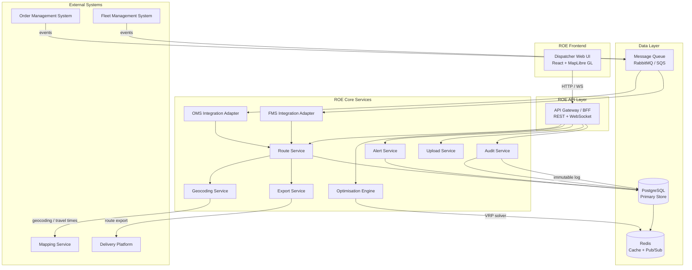
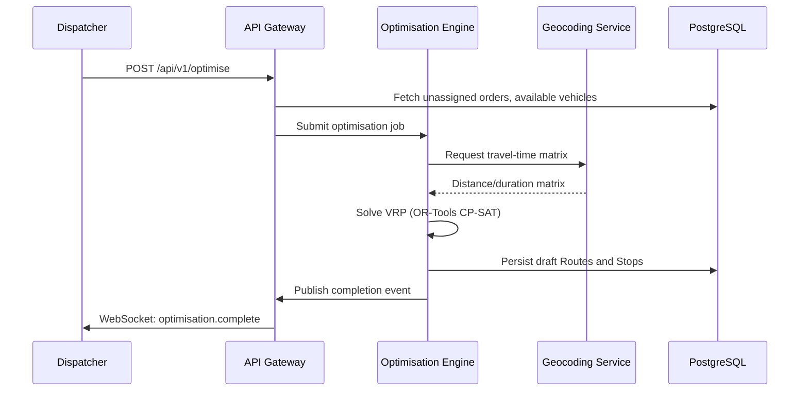
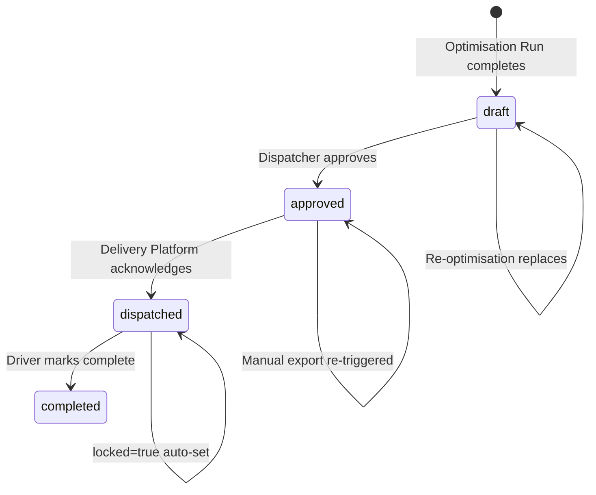
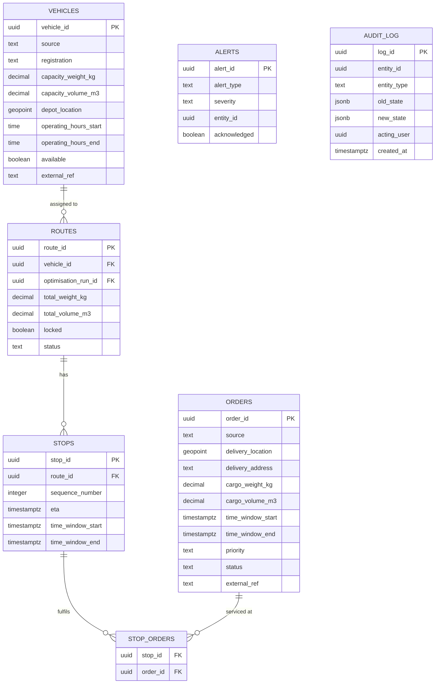
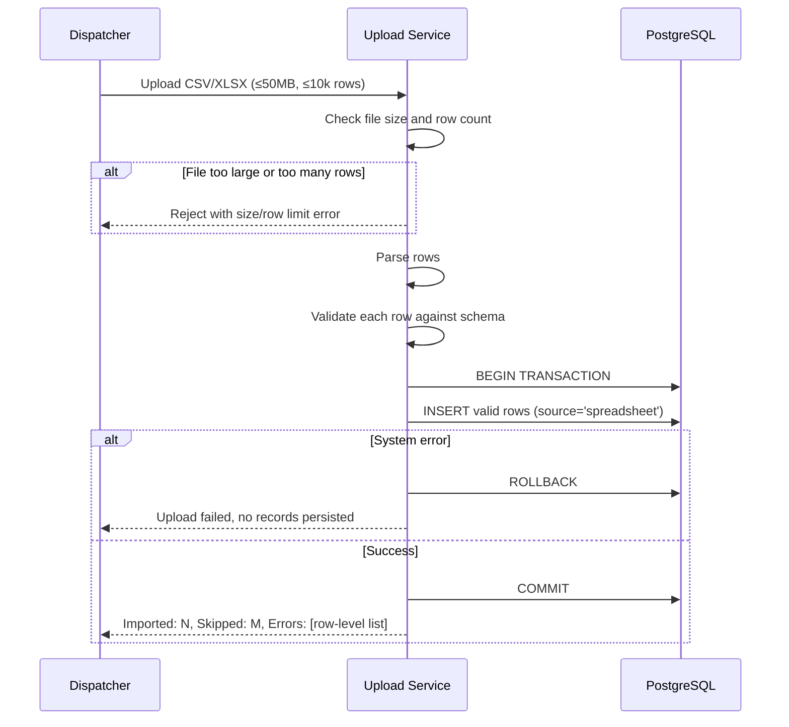
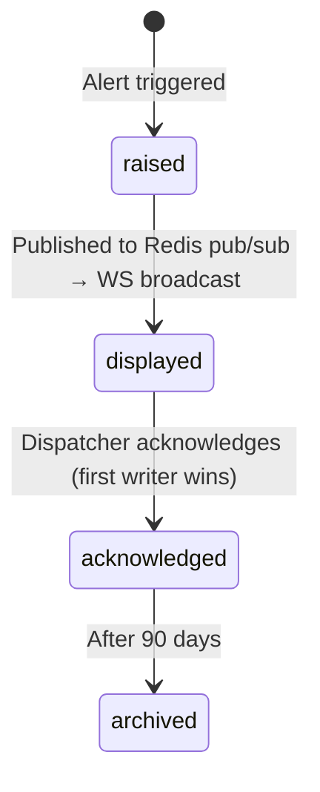

# Design Document: Route Optimisation Engine (ROE)

## Overview

The Route Optimisation Engine (ROE) is a logistics planning system that ingests delivery orders and fleet vehicle data, applies a capacity-aware Vehicle Routing Problem (VRP) solver to produce optimised routes, and exposes an interactive dispatcher interface for review, manual adjustment, and approval. Completed routes are pushed to an external Delivery Platform for driver dispatch.

The system must handle up to 500 orders and 50 vehicles in a single optimisation run within 120 seconds, support multiple concurrent dispatcher sessions, and integrate with four external systems: OMS (orders), FMS (vehicles), Mapping Service (geocoding and travel times), and Delivery Platform (route export).

### Key Design Goals

- **Correctness over speed**: All capacity and time-window constraints are hard constraints; the solver must never violate them.
- **Dispatcher control**: Every optimisation output is a draft pending dispatcher review; no route is dispatched automatically.
- **Resilience**: Every integration has a defined fallback; the ROE remains operational when any external system is unavailable.
- **Immutable audit trail**: Every state change is logged atomically with its source entity change.
- **Horizontal scalability**: Stateless API tier and solver workers allow scale-out to meet the 50-concurrent-session SLA.

---

## Architecture

### High-Level Component Diagram



### Deployment Topology

| Tier | Technology | Scaling |
|------|-----------|---------|
| Frontend | React SPA (static CDN) | CDN edge |
| API Gateway / BFF | Node.js / Express or FastAPI | Horizontal, stateless |
| Core Services | Python microservices (FastAPI) | Horizontal, stateless |
| Optimisation Worker | Python worker process (OR-Tools) | Queue-based, horizontal |
| Database | PostgreSQL 15 (managed RDS) | Single primary + read replica |
| Cache / Pub-Sub | Redis 7 | Managed cluster |
| Message Queue | RabbitMQ or AWS SQS | Managed |

### Communication Patterns

- **Synchronous REST**: UI → API Gateway for CRUD operations, route queries, manual actions.
- **WebSocket (via API Gateway)**: Real-time map updates, alert notifications, progress indicators pushed to dispatcher clients.
- **Async message queue**: OMS/FMS events → Integration Adapters → Route Service.
- **Async worker queue**: Optimisation requests → Optimisation Worker → results back via Redis pub/sub → API Gateway → WebSocket to UI.

---

## Components and Interfaces

### API Gateway / BFF

Exposes REST endpoints and a WebSocket channel to the Dispatcher UI. All endpoints require authentication (JWT). The BFF translates UI requests into internal service calls and fans out WebSocket events to connected clients.

**Key REST endpoints:**

| Method | Path | Description |
|--------|------|-------------|
| POST | `/api/v1/optimise` | Initiate an Optimisation Run |
| GET | `/api/v1/routes` | List all routes for the current planning period |
| GET | `/api/v1/routes/{id}` | Get a single route with stops |
| PATCH | `/api/v1/routes/{id}` | Update route (lock/unlock, status change) |
| POST | `/api/v1/routes/{id}/export` | Manually re-trigger Delivery Platform export |
| POST | `/api/v1/orders/reassign` | Manual order reassignment between routes |
| POST | `/api/v1/orders` | Manual order entry |
| GET | `/api/v1/orders` | List orders |
| POST | `/api/v1/vehicles` | Manual vehicle entry |
| GET | `/api/v1/vehicles` | List vehicles |
| POST | `/api/v1/upload/orders` | Spreadsheet upload for orders |
| POST | `/api/v1/upload/vehicles` | Spreadsheet upload for vehicles |
| GET | `/api/v1/upload/templates/{type}` | Download upload template |
| GET | `/api/v1/alerts` | List alerts |
| PATCH | `/api/v1/alerts/{id}/acknowledge` | Acknowledge an alert |
| GET | `/api/v1/audit` | Query audit log |
| POST | `/api/v1/users` | Admin: create user (Admin only) |
| PATCH | `/api/v1/users/{id}/role` | Admin: change user role (Admin only) |

**WebSocket events (server → client):**

| Event | Payload | Trigger |
|-------|---------|---------|
| `route.updated` | `{route_id, changes}` | Any route/stop change |
| `alert.raised` | `{alert}` | New unacknowledged alert |
| `alert.acknowledged` | `{alert_id, acknowledged_by}` | Alert acknowledged |
| `optimisation.progress` | `{run_id, progress_pct, message}` | Solver progress (≤5s intervals) |
| `optimisation.complete` | `{run_id, route_ids, locked_excluded_count}` | Solver finished |
| `optimisation.failed` | `{run_id, reason}` | Solver timeout or error |
| `connectivity.warning` | `{system, message}` | OMS/FMS/Mapping unavailable |
| `connectivity.restored` | `{system}` | Integration recovered |

### OMS Integration Adapter

Subscribes to the OMS message queue topic. Processes inbound order events:

1. Validates required fields (`delivery_location` or triggers geocoding via `delivery_address`, `cargo_weight_kg > 0`).
2. Checks for duplicate `external_ref`.
3. Persists valid Orders with `source = OMS`.
4. Raises `ImpossibleOrderAlert` for invalid/rejected events.
5. Monitors queue heartbeat; if no message for 60 seconds, raises connectivity warning via pub/sub.

### FMS Integration Adapter

Subscribes to the FMS message queue topic. Processes vehicle availability events:

1. Upserts Vehicle records by `external_ref` (create if unknown `external_ref` is a new registration; log and notify if update references unknown ref).
2. Validates required fields (`capacity_weight_kg`, `depot_location`).
3. Maintains last-known vehicle state in Redis for fallback when FMS is unavailable.

### Geocoding Service

Wraps the Mapping Service API for address resolution and travel-time matrix computation:

- **Geocoding**: Accepts an address string, returns a `GeoPoint` with confidence score. Applies confidence threshold logic (≥0.8 = store directly; <0.8 or multiple candidates = flag for review).
- **Travel-time matrix**: Accepts a list of `GeoPoint` waypoints, returns a matrix of traffic-adjusted durations between each pair.
- **Retry logic**: Queues failed geocoding requests, retries at ≤60-second intervals, up to 5 attempts.
- **Fallback**: On unavailability (>30 seconds), switches to cached historical averages from Redis; sets data-quality warning on affected routes.

### Optimisation Engine

The core VRP solver. Receives an optimisation request (set of unassigned orders, available vehicles, current locked routes) and returns a set of draft Routes.

**Internal flow:**



**Solver configuration:**
- Algorithm: Google OR-Tools CP-SAT solver (via `ortools.sat.python.cp_model`)
- Objectives (in order): minimise total travel distance (primary), minimise total travel time (secondary, as tie-breaker weight)
- Hard constraints: weight capacity, volume capacity (where defined), time windows
- Soft priority ordering: priority stops scored to prefer earlier sequence positions; violated only when hard constraints require it
- Time limit: 110 seconds of solver time (leaving 10 seconds for I/O), aborting with best incumbent solution or timeout error

### Route Service

Central business logic service coordinating route lifecycle:

- **Manual reassignment**: Validates capacity and time-window feasibility, applies stop resequencing, updates ETAs, records audit entry.
- **Route locking/unlocking**: Enforces status-based lock eligibility rules.
- **ETA recalculation**: Triggered by updated travel times from Mapping Service; propagates downstream ETA updates; raises Late Delivery Alerts for violated windows.
- **Status transitions**: Enforces the state machine: `draft → approved → dispatched → completed`.

**Route status state machine:**



### Alert Service

Manages the lifecycle of Overload, Late Delivery, and Impossible Order alerts:

- Raised by Route Service, Optimisation Engine, Geocoding Service, and Integration Adapters.
- Persisted to PostgreSQL with all required fields.
- Published to Redis pub/sub for real-time broadcast to connected dispatchers.
- Acknowledgement uses an optimistic-locking pattern: `UPDATE alerts SET acknowledged=true, acknowledged_by=$user, acknowledged_at=$now WHERE alert_id=$id AND acknowledged=false` — only the first writer succeeds.
- Alert history retained for ≥90 days (configurable retention policy via scheduled cleanup job).

### Audit Service

Provides immutable append-only audit logging:

- Called transactionally with every entity state change (using a database transaction that writes the audit entry and the entity change atomically, or rolls both back on failure).
- Audit entries are written to a dedicated `audit_log` table with `INSERT`-only access for the application role; no `UPDATE` or `DELETE` privileges granted.
- Indexed by `(entity_type, entity_id, created_at)` for fast 365-day range queries.

### Export Service

Manages delivery of approved routes to the Delivery Platform:

- On route approval, enqueues an export job.
- Implements exponential back-off retry: attempts at 0s, 5s, 15s, 35s (up to 3 retries beyond the initial attempt).
- If all retries fail, raises an export failure alert and marks the route for manual re-trigger.
- Manual re-trigger cancels any in-progress retry sequence before starting fresh.

### Upload Service

Handles bulk spreadsheet import:

- Accepts CSV and XLSX files up to 50 MB and 10,000 rows.
- Validates file size and row count on receipt (before row-level parsing).
- Validates each row against the Order or Vehicle schema.
- Uses transactional batch insert: if a system error occurs mid-import, the entire batch is rolled back.
- Reports: count of imported rows, count of skipped (invalid) rows, row-level error list (row number, column name, reason).

---

## Data Models

### Database Schema (PostgreSQL)

```sql
-- GeoPoint composite type
CREATE TYPE geopoint AS (
    latitude  DECIMAL(10, 7),
    longitude DECIMAL(11, 7)
);

-- Orders
CREATE TABLE orders (
    order_id           UUID PRIMARY KEY DEFAULT gen_random_uuid(),
    source             TEXT NOT NULL CHECK (source IN ('OMS', 'manual', 'spreadsheet')),
    pickup_location    geopoint,
    delivery_location  geopoint,
    delivery_address   TEXT NOT NULL,
    cargo_weight_kg    DECIMAL(10, 3) NOT NULL CHECK (cargo_weight_kg >= 0),
    cargo_volume_m3    DECIMAL(10, 3) CHECK (cargo_volume_m3 >= 0),
    time_window_start  TIMESTAMPTZ,
    time_window_end    TIMESTAMPTZ,
    priority           TEXT NOT NULL DEFAULT 'standard' CHECK (priority IN ('standard', 'priority')),
    status             TEXT NOT NULL DEFAULT 'unassigned'
                           CHECK (status IN ('unassigned','assigned','in_transit','delivered','failed')),
    geocode_review     BOOLEAN NOT NULL DEFAULT FALSE,
    created_at         TIMESTAMPTZ NOT NULL DEFAULT NOW(),
    updated_at         TIMESTAMPTZ NOT NULL DEFAULT NOW(),
    external_ref       TEXT UNIQUE,
    CONSTRAINT time_window_order CHECK (
        time_window_start IS NULL OR time_window_end IS NULL OR
        time_window_start <= time_window_end
    )
);

-- Vehicles
CREATE TABLE vehicles (
    vehicle_id             UUID PRIMARY KEY DEFAULT gen_random_uuid(),
    source                 TEXT NOT NULL CHECK (source IN ('FMS', 'manual', 'spreadsheet')),
    registration           TEXT NOT NULL,
    capacity_weight_kg     DECIMAL(10, 3) NOT NULL CHECK (capacity_weight_kg > 0),
    capacity_volume_m3     DECIMAL(10, 3) CHECK (capacity_volume_m3 > 0),
    depot_location         geopoint NOT NULL,
    operating_hours_start  TIME NOT NULL,
    operating_hours_end    TIME NOT NULL,
    available              BOOLEAN NOT NULL DEFAULT TRUE,
    driver_id              UUID,
    external_ref           TEXT UNIQUE,
    created_at             TIMESTAMPTZ NOT NULL DEFAULT NOW(),
    updated_at             TIMESTAMPTZ NOT NULL DEFAULT NOW()
);

-- Optimisation runs
CREATE TABLE optimisation_runs (
    run_id      UUID PRIMARY KEY DEFAULT gen_random_uuid(),
    status      TEXT NOT NULL CHECK (status IN ('in_progress', 'completed', 'timed_out', 'aborted')),
    started_at  TIMESTAMPTZ NOT NULL DEFAULT NOW(),
    ended_at    TIMESTAMPTZ,
    locked_excluded_count  INTEGER,
    initiated_by           UUID NOT NULL
);

-- Routes
CREATE TABLE routes (
    route_id             UUID PRIMARY KEY DEFAULT gen_random_uuid(),
    vehicle_id           UUID NOT NULL REFERENCES vehicles(vehicle_id),
    optimisation_run_id  UUID NOT NULL REFERENCES optimisation_runs(run_id),
    total_distance_km    DECIMAL(10, 3) NOT NULL DEFAULT 0 CHECK (total_distance_km >= 0),
    total_duration_min   INTEGER NOT NULL DEFAULT 0 CHECK (total_duration_min >= 0),
    total_weight_kg      DECIMAL(10, 3) NOT NULL DEFAULT 0 CHECK (total_weight_kg >= 0),
    total_volume_m3      DECIMAL(10, 3) CHECK (total_volume_m3 >= 0),
    locked               BOOLEAN NOT NULL DEFAULT FALSE,
    status               TEXT NOT NULL DEFAULT 'draft'
                             CHECK (status IN ('draft','approved','dispatched','completed')),
    created_at           TIMESTAMPTZ NOT NULL DEFAULT NOW(),
    updated_at           TIMESTAMPTZ NOT NULL DEFAULT NOW(),
    CONSTRAINT dispatched_routes_locked CHECK (
        status NOT IN ('dispatched', 'completed') OR locked = TRUE
    )
);

-- Stops
CREATE TABLE stops (
    stop_id              UUID PRIMARY KEY DEFAULT gen_random_uuid(),
    route_id             UUID NOT NULL REFERENCES routes(route_id) ON DELETE CASCADE,
    location             geopoint NOT NULL,
    address              TEXT NOT NULL,
    sequence_number      INTEGER NOT NULL CHECK (sequence_number >= 1),
    eta                  TIMESTAMPTZ NOT NULL,
    time_window_start    TIMESTAMPTZ,
    time_window_end      TIMESTAMPTZ,
    service_duration_min INTEGER NOT NULL DEFAULT 0 CHECK (service_duration_min >= 0),
    UNIQUE (route_id, sequence_number)
);

-- Stop-Order junction
CREATE TABLE stop_orders (
    stop_id   UUID NOT NULL REFERENCES stops(stop_id) ON DELETE CASCADE,
    order_id  UUID NOT NULL REFERENCES orders(order_id),
    PRIMARY KEY (stop_id, order_id)
);

-- Alerts
CREATE TABLE alerts (
    alert_id         UUID PRIMARY KEY DEFAULT gen_random_uuid(),
    alert_type       TEXT NOT NULL CHECK (alert_type IN ('overload', 'late_delivery', 'impossible_order')),
    severity         TEXT NOT NULL CHECK (severity IN ('warning', 'critical')),
    entity_type      TEXT NOT NULL CHECK (entity_type IN ('vehicle', 'order', 'route')),
    entity_id        UUID NOT NULL,
    message          TEXT NOT NULL,
    raised_at        TIMESTAMPTZ NOT NULL DEFAULT NOW(),
    acknowledged     BOOLEAN NOT NULL DEFAULT FALSE,
    acknowledged_by  UUID,
    acknowledged_at  TIMESTAMPTZ
);

-- Audit log (INSERT-only, no UPDATE/DELETE privileges for app role)
CREATE TABLE audit_log (
    log_id       UUID PRIMARY KEY DEFAULT gen_random_uuid(),
    entity_id    UUID NOT NULL,
    entity_type  TEXT NOT NULL CHECK (entity_type IN ('order', 'vehicle', 'route', 'alert', 'user')),
    old_state    JSONB,
    new_state    JSONB NOT NULL,
    action       TEXT NOT NULL,
    acting_user  UUID NOT NULL,
    created_at   TIMESTAMPTZ(3) NOT NULL DEFAULT NOW()
);

-- Users / RBAC
CREATE TABLE users (
    user_id     UUID PRIMARY KEY DEFAULT gen_random_uuid(),
    email       TEXT NOT NULL UNIQUE,
    role        TEXT NOT NULL CHECK (role IN ('dispatcher', 'administrator')),
    created_at  TIMESTAMPTZ NOT NULL DEFAULT NOW(),
    updated_at  TIMESTAMPTZ NOT NULL DEFAULT NOW()
);

-- Geocoding retry queue (persisted for durability)
CREATE TABLE geocoding_queue (
    queue_id    UUID PRIMARY KEY DEFAULT gen_random_uuid(),
    order_id    UUID NOT NULL REFERENCES orders(order_id),
    attempts    INTEGER NOT NULL DEFAULT 0,
    next_retry  TIMESTAMPTZ NOT NULL DEFAULT NOW(),
    created_at  TIMESTAMPTZ NOT NULL DEFAULT NOW()
);
```

**Key indexes:**

```sql
CREATE INDEX idx_orders_status ON orders(status);
CREATE INDEX idx_orders_external_ref ON orders(external_ref) WHERE external_ref IS NOT NULL;
CREATE INDEX idx_vehicles_external_ref ON vehicles(external_ref) WHERE external_ref IS NOT NULL;
CREATE INDEX idx_routes_vehicle_id ON routes(vehicle_id);
CREATE INDEX idx_routes_status ON routes(status);
CREATE INDEX idx_stops_route_id ON stops(route_id);
CREATE INDEX idx_alerts_acknowledged ON alerts(acknowledged) WHERE acknowledged = FALSE;
CREATE INDEX idx_audit_entity ON audit_log(entity_type, entity_id, created_at);
CREATE INDEX idx_audit_created_at ON audit_log(created_at);
```

### Entity Relationships



---

## Optimisation Engine Architecture

### Algorithm Approach

The ROE uses **Google OR-Tools CP-SAT solver** via the Python `ortools` package. CP-SAT is a constraint programming + SAT-based solver that handles VRP variants with capacity constraints, time windows, and multi-objective optimisation efficiently at the required scale (500 orders, 50 vehicles, 120-second time limit).

**Why OR-Tools CP-SAT:**
- Proven performance on CVRPTW (Capacitated VRP with Time Windows) benchmarks.
- Python-native, no JVM or external process.
- Supports multi-objective via weighted sum and lexicographic optimisation.
- Built-in time limit with best-incumbent solution retrieval.

**Alternative considered:** Google OR-Tools Routing Library (RoutingModel) — more ergonomic for VRP but less flexible for custom priority constraints. CP-SAT chosen for tighter control over the objective function.

### Solver Input Preparation

```python
class OptimisationRequest:
    orders: list[Order]          # unassigned orders only
    vehicles: list[Vehicle]      # available vehicles (available=True, capacity_weight_kg > 0)
    locked_routes: list[Route]   # excluded from solving, preserved as-is
    travel_time_matrix: dict     # {(from_node, to_node): seconds}
    travel_dist_matrix: dict     # {(from_node, to_node): metres}
```

**Node encoding:**
- Node 0 … N-1: depot nodes (one per vehicle, duplicated as start/end)
- Node N … N+M-1: order/stop nodes

### Constraint Formulation

1. **Weight capacity**: For each vehicle v, `sum(order.cargo_weight_kg for order in route_v) <= vehicle.capacity_weight_kg`
2. **Volume capacity** (where defined): `sum(order.cargo_volume_m3 for order in route_v) <= vehicle.capacity_volume_m3`
3. **Time windows**: For each stop s with a time window, `time_window_start[s] <= arrival_time[s] <= time_window_end[s]`
4. **Operating hours**: Vehicle departure time ≥ `operating_hours_start`; return time ≤ `operating_hours_end`
5. **Priority ordering**: A large penalty cost is applied to any solution where a standard stop precedes a priority stop on the same vehicle route. This is implemented as a soft constraint (large penalty weight) rather than a hard constraint to maintain feasibility when hard constraints would otherwise prevent ideal ordering.

### Objective Function

```
minimise: α * total_distance + β * total_time + γ * priority_violation_penalty
```

Where `α >> β` to ensure distance is the primary objective and time is secondary. `γ` is set large enough that priority ordering is preferred whenever feasible.

### Timeout and Fallback

- The solver is given a 110-second time limit (reserving 10 seconds for I/O).
- If the solver finds a feasible solution before the time limit, it returns the best incumbent.
- If no feasible solution is found within the time limit, the run is marked `timed_out`, all orders are left `unassigned`, and an error is surfaced to the dispatcher.
- Infeasible individual orders (no vehicle can accommodate them within constraints) are identified during pre-solve feasibility checking and immediately reported as Impossible Order Alerts before the main solve begins.

---

## Frontend / UI Architecture

### Technology Stack

| Layer | Technology | Rationale |
|-------|-----------|-----------|
| Framework | React 18 + TypeScript | Ecosystem maturity, component model |
| Map | MapLibre GL JS | Open-source, vector tile rendering, no usage-cost ceiling |
| State management | Zustand | Lightweight, minimal boilerplate for route/alert state |
| UI components | shadcn/ui (Radix + Tailwind) | Accessible primitives, consistent design |
| Data fetching | TanStack Query | Cache management, background refetch, optimistic updates |
| WebSocket | Native browser WebSocket with reconnect wrapper | Direct control over reconnection strategy |
| Charts/indicators | Recharts | Load utilisation bar charts in summary panel |

### Component Tree

```
App
├── AuthGuard (JWT validation, role extraction)
├── Layout
│   ├── AlertPanel (persistent, WebSocket-driven)
│   ├── ConnectivityBanner (OMS/FMS/Mapping warnings)
│   └── MainContent
│       ├── MapView (MapLibre GL canvas)
│       │   ├── RoutePolylineLayer (one per vehicle, unique colour)
│       │   ├── StopMarkerLayer (hover tooltip: seq#, address, ETA)
│       │   ├── DepotMarkerLayer
│       │   └── MapControls (zoom, layer toggles)
│       ├── RouteSummaryPanel
│       │   ├── RouteList (sortable, filterable)
│       │   │   └── RouteListItem (load bar, warning/critical indicator, drag source)
│       │   └── OptimiseButton / ReoptimiseButton + progress bar
│       ├── RouteDetailPanel (selected route)
│       │   ├── StopList (reorderable, drag target for order reassignment)
│       │   └── RouteActions (lock/unlock, approve, export)
│       └── StopDetailPanel (selected stop)
│           └── OrderList + cargo summary
├── ManualEntryDrawer
│   ├── OrderForm
│   └── VehicleForm
├── UploadDrawer
│   ├── FileDropzone
│   └── ValidationResultTable
└── AuditLogModal (Admin only)
```

### Interactive Map Behaviour

- Each vehicle's route is rendered as a distinct polyline with a deterministic colour derived from `vehicle_id` hash.
- Stop markers use a cluster layer below zoom level 12 and individual markers above.
- Depot markers are rendered as a separate symbol layer.
- Route/stop selection uses MapLibre's `queryRenderedFeatures` on click.
- Drag-and-drop reassignment is implemented via pointer events on the `StopList` component (not on the map canvas), with the map zooming to the affected stops on confirmation.
- Map data is updated within 5 seconds of any route/stop change by invalidating TanStack Query cache on WebSocket `route.updated` events.

### Load Utilisation Indicators

| Condition | Indicator |
|-----------|-----------|
| weight < 90% of capacity | Green progress bar |
| 90% ≤ weight < 100% | Amber progress bar + warning icon |
| weight ≥ 100% | Red progress bar + critical icon + Overload Alert |

---

## Integration Adapters

### OMS Adapter

**Protocol**: Message queue subscription (AMQP or SQS). The OMS publishes JSON events to a dedicated queue topic.

**Event processing:**

```python
def process_oms_event(event: dict) -> None:
    # 1. Validate required fields
    errors = validate_order_event(event)
    if errors:
        raise_impossible_order_alert(event, errors)
        return

    # 2. Deduplicate by external_ref
    if order_exists_by_external_ref(event['order_id']):
        return  # discard silently

    # 3. Geocode address if delivery_location not provided
    geo = geocode_if_needed(event)

    # 4. Persist
    create_order(event, geo, source='OMS')
```

**Health monitoring**: A background watchdog pings the OMS queue every 15 seconds. If no successful ping for 60 seconds, publishes a `connectivity.warning` event to Redis pub/sub, which the API Gateway broadcasts to all connected dispatcher clients.

### FMS Adapter

**Protocol**: Message queue subscription (AMQP or SQS).

**Upsert logic:**

```python
def process_fms_event(event: dict) -> None:
    errors = validate_vehicle_event(event)
    if errors:
        reject_vehicle(event, errors)
        return

    existing = find_vehicle_by_external_ref(event['external_ref'])
    if existing:
        update_vehicle(existing.vehicle_id, event)
    elif event['event_type'] == 'new_registration':
        create_vehicle(event, source='FMS')
    else:
        # Update for unknown external_ref
        log_unknown_ref(event['external_ref'])
        notify_dispatcher(f"Received FMS update for unknown vehicle ref: {event['external_ref']}")
```

**Fallback**: Vehicle records are cached in Redis on every successful FMS update. On FMS unavailability, the Route Service reads from the Redis cache. A `connectivity.warning` is raised immediately on FMS queue health-check failure.

### Mapping Service Adapter

**Protocol**: HTTPS REST API (third-party provider, e.g., Valhalla self-hosted or Google Maps Platform with cost controls).

**Geocoding request:**
```json
GET /geocode?address={encoded_address}
Response: {
    "candidates": [
        {"lat": 51.5074, "lon": -0.1278, "confidence": 0.95, "formatted_address": "..."}
    ]
}
```

**Travel-time matrix request:**
```json
POST /matrix
Body: {"sources": [{"lat":..,"lon":..}], "targets": [{"lat":..,"lon":..}], "costing": "auto"}
Response: {"sources_to_targets": [[{"time": 720, "distance": 4200}, ...]]}
```

**Fallback strategy:**
- Historical average travel times are computed from completed route data and stored in Redis, keyed by `(from_geohash_6, to_geohash_6)`.
- On Mapping Service unavailability (>30s), the Geocoding Service switches to these averages and sets a `data_quality_warning` flag on all affected routes.

### Delivery Platform Adapter

**Protocol**: HTTPS REST API (outbound push).

**Export payload:**
```json
POST /delivery-platform/routes
{
    "route_id": "uuid",
    "vehicle_registration": "string",
    "driver_id": "uuid",
    "stops": [
        {
            "sequence": 1,
            "address": "string",
            "lat": 0.0,
            "lon": 0.0,
            "eta_utc": "ISO8601",
            "order_ids": ["uuid"],
            "service_duration_min": 10
        }
    ]
}
```

**Retry sequence** (exponential back-off):

| Attempt | Delay |
|---------|-------|
| 1 (initial) | 0s |
| 2 | 5s |
| 3 | 10s |
| 4 | 20s |

After attempt 4 fails, route remains `approved` and an export failure alert is raised.

---

## Manual Fallback Handling

### Spreadsheet Upload Pipeline



**Template format** (Order example):

| Column | Type | Required | Example |
|--------|------|----------|---------|
| delivery_address | string | Yes | 10 Downing St, London |
| cargo_weight_kg | decimal | Yes | 12.5 |
| cargo_volume_m3 | decimal | No | 0.3 |
| time_window_start | ISO 8601 | No | 2024-06-01T09:00:00Z |
| time_window_end | ISO 8601 | No | 2024-06-01T12:00:00Z |
| priority | standard\|priority | Yes | standard |

### Manual Entry Forms

Both Order and Vehicle forms perform client-side validation (field presence, range checks) before submission. Server-side validation re-applies the same rules. On server rejection, the API response includes a structured error object:

```json
{
    "error": "validation_failed",
    "fields": [
        {"field": "cargo_weight_kg", "message": "Must be between 0.01 and 99999.99"}
    ]
}
```

The form component maps these errors to per-field error messages while preserving all entered values in local state.

---

## Alert and Notification Subsystem

### Alert Lifecycle



### Alert Routing

| Alert Type | Triggered By | Severity |
|------------|-------------|---------|
| Overload | Route Service (weight/volume check) | critical |
| Late Delivery | Route Service (ETA recalculation), Optimisation Engine | warning |
| Impossible Order | OMS Adapter, FMS Adapter, Optimisation Engine, Geocoding Service | critical |
| Export Failure | Export Service | critical |
| Connectivity Warning | OMS/FMS/Mapping health watchdogs | warning |

### Concurrent Acknowledgement

The Alert Service uses a single `UPDATE ... WHERE acknowledged = false` query. PostgreSQL row-level locking guarantees only one concurrent transaction succeeds. The response to the losing transaction is a 409 Conflict with message "Alert already acknowledged".

---

## Audit Logging Subsystem

### Audit Entry Structure

Every entity state change is wrapped in a database transaction that includes:

1. The entity change (UPDATE/INSERT on `orders`, `vehicles`, `routes`, `alerts`).
2. An INSERT into `audit_log` capturing: `entity_id`, `entity_type`, `old_state` (JSONB snapshot), `new_state` (JSONB snapshot), `action` (e.g., `order.status.changed`, `route.locked`), `acting_user` (UUID), `created_at` (TIMESTAMPTZ with millisecond precision).

If the audit INSERT fails, the transaction rolls back and the entity change is not applied. The failure is written to a separate `error_log` table (outside the transaction) and displayed to the acting user.

### Immutability Enforcement

The database application role used by the ROE services is granted:
- `INSERT` on `audit_log`
- `SELECT` on `audit_log`
- No `UPDATE`, `DELETE`, or `TRUNCATE` on `audit_log`

An additional database-level trigger rejects any attempt to update or delete an audit row, providing defence-in-depth:

```sql
CREATE RULE audit_no_update AS ON UPDATE TO audit_log DO INSTEAD NOTHING;
CREATE RULE audit_no_delete AS ON DELETE TO audit_log DO INSTEAD NOTHING;
```

### Retention and Querying

- A scheduled job purges audit entries older than 365 days (configurable).
- Completed Route records (including stops and associated order snapshots) are retained for 365 days separately.
- The `GET /api/v1/audit` endpoint supports filtering by `entity_type`, `entity_id`, `from_date`, `to_date`, and `acting_user`. The composite index on `(entity_type, entity_id, created_at)` ensures sub-5-second response for full 365-day queries.

---

## Access Control / RBAC Design

### Role Matrix

| Action | Dispatcher | Administrator |
|--------|-----------|--------------|
| View routes and stops | ✓ | ✓ |
| Manual order/vehicle entry | ✓ | ✓ |
| Spreadsheet upload | ✓ | ✓ |
| Trigger optimisation / re-optimisation | ✓ | ✓ |
| Manual order reassignment | ✓ | ✓ |
| Lock / unlock routes | ✓ | ✓ |
| Approve routes | ✓ | ✓ |
| Acknowledge alerts | ✓ | ✓ |
| View audit log | ✗ | ✓ |
| User management | ✗ | ✓ |
| Integration configuration | ✗ | ✓ |
| Manual export re-trigger | ✓ | ✓ |

### Authentication Flow

1. Users authenticate via a JWT-issuing identity provider (e.g., Auth0, Keycloak, or AWS Cognito).
2. The API Gateway validates the JWT on every request (signature, expiry, issuer).
3. The `role` claim in the JWT is extracted and compared against the required permission for the endpoint.
4. The JWT is short-lived (15-minute expiry) with a sliding refresh token (24-hour expiry) to ensure role changes propagate within 60 seconds (a user's next token refresh picks up the new role from the IdP).
5. Unauthorized access attempts are logged via the Audit Service with `action = 'access.denied'`.

### Permission Enforcement

All permission checks are applied at the API Gateway middleware layer before request forwarding. Each route handler is decorated with a `@require_role([...])` annotation. Permission denials return HTTP 403 with a body of `{"error": "forbidden", "message": "Action not permitted for role: dispatcher"}`.

---

## Error Handling

### Integration Failures

| Failure | Behaviour |
|---------|-----------|
| OMS unavailable > 60s | Connectivity warning to all dispatchers; manual/spreadsheet entry remains available |
| FMS unavailable | Stale-data warning; operate from Redis cache; warning auto-clears on restoration |
| Mapping Service unavailable > 30s | Fall back to cached historical travel times; data-quality warning on affected routes; retry every ≤60s |
| Delivery Platform export failure | Retry 3× with exponential back-off; export failure alert on exhaustion; manual re-trigger available |
| Geocoding failure | Queue for retry (up to 5 attempts, ≤60s intervals); Impossible Order Alert on exhaustion |

### Solver Failures

| Failure | Behaviour |
|---------|-----------|
| Run exceeds 120s | Abort; all processed orders remain `unassigned`; timeout error to dispatcher |
| No vehicles available | Abort immediately; error to dispatcher; no routes produced |
| Individual order infeasible | Leave order `unassigned`; raise Impossible Order Alert; continue solving remainder |

### Manual Operation Failures

| Failure | Behaviour |
|---------|-----------|
| Form validation failure | HTTP 422; field-level errors; entered values preserved in client state |
| Persistence failure within 2s | HTTP 500 displayed to dispatcher; values preserved in form |
| Reassignment recalculation fails / >10s | Both routes reverted; error displayed; audit entry not written |
| Audit write failure | Entity state change rolled back; error displayed; error_log entry written |

### Transactional Guarantees

All operations that mutate entity state use database transactions. The audit log entry and the entity change are committed atomically. Partial failures are fully rolled back. The Upload Service processes spreadsheet rows in a single transaction per file.

---

## Testing Strategy

### Dual Testing Approach

The ROE's testing strategy combines unit/example-based tests for specific behaviours with property-based tests for universal correctness guarantees.

**Unit and integration tests** cover:
- Specific field mapping examples for OMS/FMS adapters
- UI component rendering (snapshot tests for map components)
- Export retry sequencing (specific timing examples)
- Integration tests for external service interactions (OMS, FMS, Mapping Service, Delivery Platform)
- Smoke tests for configuration (RBAC roles, CloudWatch/logging setup, retention policies)

**Property-based tests** (using [Hypothesis](https://hypothesis.readthedocs.io/) for Python) cover the universal correctness properties defined below. Each property test runs a minimum of 100 iterations with randomly generated inputs.

**Property test tag format:** `# Feature: route-optimisation-engine, Property {N}: {property_text}`

---

## Correctness Properties

*A property is a characteristic or behavior that should hold true across all valid executions of a system — essentially, a formal statement about what the system should do. Properties serve as the bridge between human-readable specifications and machine-verifiable correctness guarantees.*

### Property 1: OMS event validation rejects missing required fields

*For any* OMS order event where `delivery_location` is null/missing or `cargo_weight_kg` is null/missing/non-positive, the system shall create no Order record and shall raise an Impossible Order Alert whose message identifies the missing or invalid field by name.

**Validates: Requirements 1.2, 1.3**

---

### Property 2: OMS field mapping preserves all data

*For any* valid OMS order event, ingesting it shall produce an Order record where every OMS field is correctly mapped to the Order schema and `external_ref` equals the OMS order identifier.

**Validates: Requirements 1.4**

---

### Property 3: OMS deduplication is idempotent

*For any* `external_ref` value, submitting the same OMS order event multiple times shall result in exactly one Order record with that `external_ref` — subsequent submissions are silently discarded without creating additional records.

**Validates: Requirements 1.6**

---

### Property 4: FMS vehicle creation sets correct source and external_ref

*For any* valid FMS new-registration event, the resulting Vehicle record shall have `source = FMS` and `external_ref` equal to the FMS reference identifier.

**Validates: Requirements 2.2**

---

### Property 5: FMS upsert never duplicates vehicles

*For any* FMS update event referencing an `external_ref` that already exists in the system, the total count of Vehicle records with that `external_ref` shall remain exactly one, and the existing record shall be updated with the event's data.

**Validates: Requirements 2.3**

---

### Property 6: FMS validation rejects records with missing required fields

*For any* FMS vehicle event missing `capacity_weight_kg` or `depot_location`, the system shall reject the record, ensure no Vehicle record is created or updated with that data, and notify the Dispatcher identifying the vehicle's FMS reference and the missing field.

**Validates: Requirements 2.5**

---

### Property 7: Manual form validation rejects invalid submissions atomically

*For any* manual Order or Vehicle form submission containing one or more fields that are missing or outside their valid ranges, the system shall persist no record, preserve all entered values, and return a field-level error identifying each invalid field.

**Validates: Requirements 3.3**

---

### Property 8: Manual form submissions set source = manual

*For any* valid manual Order or Vehicle form submission, the persisted record shall have `source = manual`.

**Validates: Requirements 3.4**

---

### Property 9: Spreadsheet upload transactional atomicity

*For any* spreadsheet upload that encounters a system error during processing, the system shall persist zero records from that upload — no partial imports shall occur.

**Validates: Requirements 4.8**

---

### Property 10: Spreadsheet row validation correctly partitions valid and invalid rows

*For any* spreadsheet containing a mix of valid and invalid rows, the count of imported records shall equal the number of valid rows, the count of skipped rows shall equal the number of invalid rows, and the error list shall identify each invalid row by row number, column name, and reason.

**Validates: Requirements 4.4, 4.5**

---

### Property 11: Optimisation run produces complete assignment coverage

*For any* set of unassigned orders and available vehicles, after an Optimisation Run every order shall be either assigned to a route or have an Impossible Order Alert raised — no order shall be silently left unprocessed.

**Validates: Requirements 5.1, 5.7**

---

### Property 12: Weight capacity invariant

*For any* Optimisation Run output, for every produced Route, `route.total_weight_kg` shall not exceed `vehicle.capacity_weight_kg` for the assigned vehicle.

**Validates: Requirements 5.2**

---

### Property 13: Volume capacity invariant

*For any* Optimisation Run output, for every produced Route assigned to a vehicle with a defined `capacity_volume_m3`, `route.total_volume_m3` shall not exceed `vehicle.capacity_volume_m3`.

**Validates: Requirements 5.3**

---

### Property 14: Time window compliance invariant

*For any* Optimisation Run output, for every Stop that has a defined `time_window_start` and `time_window_end`, the stop's ETA shall fall within the interval `[time_window_start, time_window_end]`, or an Impossible Order Alert shall have been raised for the associated order indicating infeasibility.

**Validates: Requirements 5.4**

---

### Property 15: Priority ordering invariant

*For any* Route produced by an Optimisation Run containing both priority and standard stops, no standard stop shall appear at a sequence position earlier than any priority stop unless a capacity or time-window constraint requires it.

**Validates: Requirements 6.1**

---

### Property 16: ETA recalculation propagates downstream consistently

*For any* route with updated travel times for one or more segments, all ETAs for stops downstream of the updated segment shall be recalculated to reflect the cumulative travel time from the depot, and no downstream ETA shall be stale relative to its upstream travel time.

**Validates: Requirements 7.2**

---

### Property 17: Late delivery alerts raised for all time window violations

*For any* stop whose recalculated ETA exceeds its `time_window_end` by more than 0 minutes, a Late Delivery Alert with `severity = warning` shall be raised referencing that stop.

**Validates: Requirements 7.3, 14.2**

---

### Property 18: Route summary panel displays accurate metrics

*For any* route, the data displayed in the Route summary panel shall exactly match the route's stored `total_distance_km` (to 2 decimal places), `total_duration_min` (as a whole number), `total_weight_kg`, and the correct weight load utilisation percentage computed as `(total_weight_kg / vehicle.capacity_weight_kg) * 100` rounded to 1 decimal place.

**Validates: Requirements 8.4, 9.1**

---

### Property 19: Capacity threshold indicators are correct for all utilisation values

*For any* route, the load utilisation indicator shown in the Route summary panel shall be:
- No warning indicator when weight < 90% of `capacity_weight_kg`
- A warning indicator when 90% ≤ weight < 100% of `capacity_weight_kg`
- A critical indicator and an Overload Alert raised when weight ≥ 100% of `capacity_weight_kg`

**Validates: Requirements 9.2, 9.3, 14.1**

---

### Property 20: Manual reassignment recalculation is consistent

*For any* valid manual order reassignment between two routes, the resulting routes' `total_weight_kg`, `total_volume_m3`, stop sequences, and ETAs shall be internally consistent — `total_weight_kg` shall equal the sum of `cargo_weight_kg` for all assigned orders, and ETAs shall be monotonically increasing along the stop sequence.

**Validates: Requirements 10.2**

---

### Property 21: Manual reassignment capacity rejection

*For any* manual reassignment that would cause the receiving route's `total_weight_kg` to exceed `vehicle.capacity_weight_kg`, or `total_volume_m3` to exceed `vehicle.capacity_volume_m3`, the system shall reject the operation and leave both routes unchanged.

**Validates: Requirements 10.3, 10.4**

---

### Property 22: Locked route reassignment rejection

*For any* manual reassignment where the destination route has `locked = true`, the system shall reject the operation and leave both routes unchanged.

**Validates: Requirements 10.6**

---

### Property 23: Manual reassignment audit completeness

*For any* successfully completed manual reassignment, an audit log entry shall exist containing the acting Dispatcher's user ID, the source route ID, the destination route ID, the order ID, the old state, the new state, and a UTC timestamp.

**Validates: Requirements 10.8**

---

### Property 24: Route locking state machine

*For any* route in any status, the system shall permit `locked = true` to be set only when `status IN ('draft', 'approved')`, and shall permit `locked = false` to be set only when `status NOT IN ('dispatched', 'completed')`.

**Validates: Requirements 11.1, 11.2, 11.4, 11.5**

---

### Property 25: Locked routes are excluded from re-optimisation and preserved exactly

*For any* re-optimisation run, every route with `locked = true` shall be identical before and after the run — the same stops, same order assignments, same ETAs — and the run output shall include the count of excluded locked routes.

**Validates: Requirements 11.3, 12.2**

---

### Property 26: Dispatched routes are automatically locked

*For any* route that transitions to `status = dispatched`, `locked` shall be `true` immediately upon that transition.

**Validates: Requirements 11.6**

---

### Property 27: Concurrent optimisation runs are rejected

*For any* attempt to trigger an Optimisation Run or re-optimisation while a run is already in progress, the system shall reject the new trigger and display a message indicating a run is already in progress.

**Validates: Requirements 12.7**

---

### Property 28: Export retry respects exponential back-off

*For any* failed Delivery Platform export, the retry sequence shall attempt no more than 3 retries and the delay between each attempt shall double starting from 5 seconds (i.e., 5s, 10s, 20s), with no retry interval exceeding 20 seconds.

**Validates: Requirements 13.3**

---

### Property 29: Alert acknowledgement is first-writer-wins

*For any* alert, only the first acknowledgement shall be recorded — `acknowledged_by`, `acknowledged_at` shall reflect the first acknowledging dispatcher — and all subsequent acknowledgement attempts shall be rejected with a conflict response.

**Validates: Requirements 14.5, 14.6**

---

### Property 30: Geocoding confidence threshold logic

*For any* geocoding response, the system shall store the returned `GeoPoint` in `delivery_location` without a review flag when the confidence score is ≥ 0.8, and shall store the highest-confidence result with a review flag when the score is < 0.8 or multiple candidates are returned.

**Validates: Requirements 15.2, 15.3**

---

### Property 31: Coordinate validation rejects out-of-range values

*For any* manually supplied coordinates, the system shall accept latitude values in [−90, +90] and longitude values in [−180, +180], and shall reject any values outside these ranges with a descriptive error.

**Validates: Requirements 15.5**

---

### Property 32: Audit log entries are created for every state change

*For any* state change on an Order, Vehicle, Route, or Alert entity, an audit log entry shall exist with the correct `entity_id`, `entity_type`, `old_state`, `new_state`, `acting_user`, and a UTC timestamp with millisecond precision.

**Validates: Requirements 16.1**

---

### Property 33: Audit log entries are immutable

*For any* audit log entry, any attempt to modify or delete it through any system interface shall be rejected — the entry shall remain identical to its originally written form.

**Validates: Requirements 16.4**

---

### Property 34: Audit write failure prevents entity state change

*For any* operation that writes an entity state change, if the corresponding audit log write fails, the entity state change shall be rolled back — no entity update shall be applied without a corresponding audit entry.

**Validates: Requirements 16.5**

---

### Property 35: RBAC denies out-of-role actions for all users

*For any* authenticated user, any action outside the user's role shall be denied with a 403 response, and the denial shall be recorded in the audit log with the user identity, attempted action, and UTC timestamp.

**Validates: Requirements 17.2, 17.3, 17.5**

---

### Property 36: All API endpoints deny unauthenticated requests

*For any* API endpoint, a request without valid authentication credentials shall receive an authentication error response and be denied access to the requested resource.

**Validates: Requirements 17.4**
